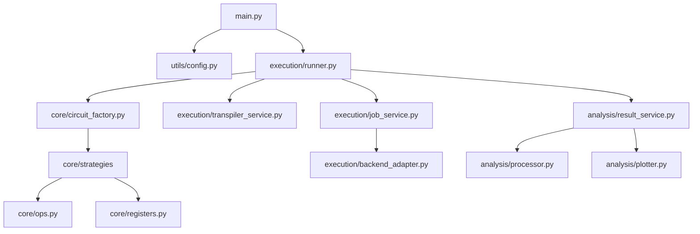

# Refactoring Plan for QPA Cyclic Project

This document outlines the proposed refactoring to improve the modularity, readability, and maintainability of the QPA Cyclic Project.

## 1. Architectural Overview

The current architecture suffers from:
- **Coupled Logic**: `main.py` contains heavy business logic (execution loops, result processing) that should be modularized.
- **Code Duplication**: Similar logic exists in `DynamicCircuitBuilder` and `UnrolledHybridStrategy` (e.g., `schur_test`, `cyclic_rotation`).
- **Ambiguous Boundaries**: `JobManager` handles transpilation and result saving, which violates the Single Responsibility Principle.
- **Redundant Files**: `core/post_selection.py` vs `analysis/post_selection.py`.
- **Hardcoded Paths**: Directory structure logic is scattered and brittle.

### Proposed Architecture

## 2. Core Modules Refactoring

### 2.1. Unified Circuit Factory (`core/circuit_factory.py`)
- **Goal**: Standardize circuit creation.
- **Changes**:
    - Create a `CircuitFactory` that returns the appropriate builder (`Dynamic` or `Unrolled`) based on configuration.
    - Define a clean interface `ICircuitBuilder`.

### 2.2. Common Operations (`core/ops.py`)
- **Goal**: Remove duplication.
- **Changes**:
    - Extract `schur_test`, `cyclic_rotation`, `swap_registers` into a mixin or functional library `core.ops`.
    - Both `DynamicCircuitBuilder` and `UnrolledHybridStrategy` should use these common functions.

### 2.3. Register Abstraction (`core/registers.py`)
- **Goal**: Reduce index arithmetic errors.
- **Changes**:
    - Create a `QPARegisters` class that manages `QuantumRegister` creation and indexing (e.g., `get_pair(i)`, `get_reserve()`).
    - Eliminate manual `idx * k + b` calculations.

### 2.4. Strategy Pattern (`core/strategies/`)
- **Goal**: Isolate generation logic.
- **Changes**:
    - Move `DynamicCircuitBuilder` and `UnrolledHybridStrategy` into a `strategies` package.
    - Ensure both implement a consistent interface.

## 3. Execution Modules Refactoring

### 3.1. Simulation Runner (`execution/runner.py`)
- **Goal**: Clean up `main.py`.
- **Changes**:
    - Move the execution loops (parallel vs. sequential, batching logic) into a `SimulationRunner` class.
    - `main.py` should only handle CLI args and instantiate `SimulationRunner`.

### 3.2. Transpilation Service (`execution/transpiler_service.py`)
- **Goal**: Decouple transpilation from submission.
- **Changes**:
    - Extract transpilation logic (parallel processing, optimization levels) from `JobManager` into `TranspilerService`.
    - Support caching or pre-computation of transpiled circuits.

### 3.3. Job Service (`execution/job_service.py`)
- **Goal**: Focus on submission and lifecycle.
- **Changes**:
    - Rename `JobManager` to `JobService`.
    - Remove transpilation logic.
    - Unify `submit_batch` and `retrieve_result`.
    - Handle local vs. remote jobs transparently.

### 3.4. Backend Adapter (`execution/backend_adapter.py`)
- **Goal**: Simplify backend handling.
- **Changes**:
    - Consolidate `AERHandler`, `FakeBackendHandler`, `IBMRuntimeHandler` into a unified `BackendAdapter` interface.
    - Provide a single `get_backend(name)` factory method.

## 4. Analysis Modules Refactoring

### 4.1. Result Service (`analysis/result_service.py`)
- **Goal**: Unified result access.
- **Changes**:
    - Create a service to fetch results from memory, local disk (JSON), or IBM Cloud.
    - Integrate `ResultProcessor` logic here.

### 4.2. Cleanup Post-Selection
- **Goal**: Remove redundancy.
- **Changes**:
    - Delete `core/post_selection.py` (it's a dummy).
    - Move `analysis/post_selection.py` to `analysis/filters.py` or keep it but ensure it's the single source of truth.

## 5. Utilities Refactoring

### 5.1. Path Manager (`utils/paths.py`)
- **Goal**: Centralize directory logic.
- **Changes**:
    - Create a `PathManager` class that constructs paths like `data/jobs/backend/device/param/timestamp`.
    - Remove all `os.path.join` calls from business logic.

### 5.2. Configuration (`utils/config.py`)
- **Goal**: Centralize settings.
- **Changes**:
    - Move `argparse` logic and constants (defaults) to `utils/config.py`.
    - Use a `Config` dataclass to pass parameters instead of raw `args` namespace.

## 6. Action Plan

1.  **Setup**: Create new directories (`utils`, `core/strategies`).
2.  **Core Extraction**:
    - Create `core/ops.py` and move `schur_test`, `cyclic_rotation`.
    - Refactor builders to use `core/ops.py`.
3.  **Path & Config**:
    - Implement `utils/paths.py` and `utils/config.py`.
4.  **Execution Refactor**:
    - Create `execution/transpiler_service.py`.
    - Refactor `JobManager` -> `JobService`.
    - Create `execution/runner.py`.
5.  **Main Refactor**:
    - Rewrite `main.py` to use `SimulationRunner`.
6.  **Cleanup**:
    - Delete `core/post_selection.py`.
    - Remove `legacy/` folder (or archive it properly).

## 7. Benefits

- **Readability**: Logic is split into small, focused classes.
- **Testability**: Components like `TranspilerService` and `CircuitFactory` can be tested in isolation.
- **Maintainability**: Changing directory structure or backend logic only requires updating one file (`PathManager` or `BackendAdapter`).
- **Extensibility**: Adding a new method (e.g., "Partially Unrolled") is as simple as adding a new Strategy.
